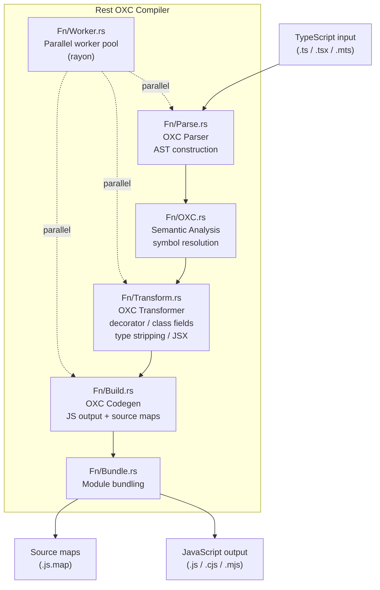

# Rest: OXC TypeScript Compiler ☕

This document describes `Rest`, a high-performance `TypeScript` compiler built
on the OXC (Oxidation Compiler) toolchain:

- Replaces `esbuild`'s `TypeScript` loader with a `Rust`-powered OXC pipeline
- Produces VS Code-compatible output at 2-3x speed improvement
- Handles decorators, class field transformations, JSX, and type stripping

---

## Table of Contents

1. [Overview](#overview)
2. [Architecture](#architecture)
3. [Compilation Pipeline](#compilation-pipeline)
4. [Configuration](#configuration)
5. [CLI Usage](#cli-usage)
6. [Integration with Output](#integration-with-output)
7. [Performance Benchmarks](#performance-benchmarks)
8. [Related Documentation](#related-documentation)

---



## Overview 📋

`Rest` is a `Rust` binary and library that provides a
`TypeScript`-to-`JavaScript` compiler using the OXC toolchain:

- Handles decorators, class field transformations, JSX, and TypeScript type
  stripping
- Produces output compatible with VS Code's module system
- Integrates with `Output`'s build pipeline via `RestPlugin`

| Attribute    | Value                                                                                                                             |
| ------------ | --------------------------------------------------------------------------------------------------------------------------------- |
| Language     | `Rust` (edition 2024)                                                                                                             |
| Crate type   | Binary + Library                                                                                                                  |
| OXC version  | 0.48+                                                                                                                             |
| Dependencies | `oxc_allocator`, `oxc_parser`, `oxc_transformer`, `oxc_codegen`, `oxc_semantic`, `oxc_span`, `oxc_ast`, `Common`, `clap`, `rayon` |
| Consumed by  | `Output` (optional `RestPlugin`)                                                                                                  |

---

## Architecture 🏗️

```
+---------------------------------------------------------+
|                       Rest                               |
|                                                          |
|  +------------------+  +------------------+              |
|  | Fn/Parse.rs      |  | Fn/Transform.rs  |             |
|  | OXC parser entry |  | OXC transformer  |             |
|  +------------------+  +------------------+              |
|                                                          |
|  +------------------+  +------------------+              |
|  | Fn/Build.rs      |  | Fn/Bundle.rs     |             |
|  | Build pipeline   |  | Module bundler   |             |
|  +------------------+  +------------------+              |
|                                                          |
|  +------------------+  +------------------+              |
|  | Struct/Compiler  |  | Fn/Worker.rs     |             |
|  | Config.rs        |  | Parallel worker  |             |
|  | Compiler config  |  | pool             |             |
|  +------------------+  +------------------+              |
+---------------------------------------------------------+
```

### Module Map 🗺️

| Path                              | Purpose                              |
| --------------------------------- | ------------------------------------ |
| `Source/Binary.rs`                | Binary entry point                   |
| `Source/Fn/Build.rs`              | Build pipeline orchestration         |
| `Source/Fn/Bundle.rs`             | Module bundling                      |
| `Source/Fn/Transform.rs`          | `TypeScript` transformation pipeline |
| `Source/Fn/OXC.rs`                | OXC compiler integration             |
| `Source/Fn/Worker.rs`             | Parallel worker pool                 |
| `Source/Fn/NLS.rs`                | Natural language search integration  |
| `Source/Struct/CompilerConfig.rs` | Compiler configuration types         |
| `Source/Library.rs`               | Library root for integration         |
| `Source/Main.rs`                  | Alternative entry point              |

---

## Compilation Pipeline 🔧

The OXC compilation pipeline processes `TypeScript` input through multiple
stages:

```
TypeScript input (.ts, .tsx, .mts, .cts)
    |
    v
1. OXC Parser (oxc_parser)
    - Produces AST with full source location tracking
    - Handles TypeScript syntax extensions
    - Supports decorators, JSX, and modern ECMAScript
    |
    v
2. OXC Semantic Analysis (oxc_semantic)
    - Symbol resolution and scope analysis
    - Binding and reference tracking
    - Type checking (scope-level only, not full type inference)
    |
    v
3. OXC Transformer (oxc_transformer)
    - Decorator lowering to ES5/ES2015 patterns
    - Class field transformations (public/private field lowering)
    - TypeScript type annotation stripping
    - JSX transformation to createElement calls
    - Target ES version lowering
    |
    v
4. OXC Code Generator (oxc_codegen)
    - JavaScript source output
    - Source map generation (VLQ-encoded mappings)
    - (Optional) OXC Minifier for compressed output
    |
    v
JavaScript output (.js, .cjs, .mjs)
```

### Parallel Processing ⚡

`Rest` uses `rayon` for parallel file compilation:

```rust
// Worker pool processes files in parallel
input_files.par_iter().map(|file| {
    compile_file(file, &config)
}).collect::<Result<Vec<Output>>>()
```

By default, one worker per logical CPU core is used. This can be overridden with
the `--workers N` flag.

---

## Configuration ⚙️

`Rest` reads configuration from CLI flags and environment variables:

| Flag             | Env Variable        | Default    | Description                   |
| ---------------- | ------------------- | ---------- | ----------------------------- |
| `--entry`        | `REST_ENTRY`        | (required) | Entry point file or directory |
| `--out-dir`      | `REST_OUT_DIR`      | `dist/`    | Output directory              |
| `--target`       | `REST_TARGET`       | `es2022`   | Target ECMAScript version     |
| `--sourcemap`    | `REST_SOURCEMAP`    | `false`    | Generate source maps          |
| `--minify`       | `REST_MINIFY`       | `false`    | Minify output                 |
| `--workers`      | `REST_WORKERS`      | CPU count  | Parallel worker count         |
| `--decorators`   | `REST_DECORATORS`   | `legacy`   | Decorator metadata mode       |
| `--class-fields` | `REST_CLASS_FIELDS` | `define`   | Class field emit mode         |

### Output Configuration 📝

```sh
rest --entry src/index.ts \
	--out-dir lib/ \
	--target es2022 \
	--sourcemap \
	--decorators legacy
```

---

## CLI Usage 💻

```sh
# Single file compilation
rest --entry src/index.ts --out-dir dist/

# Directory compilation (parallel)
rest --entry src/ --out-dir dist/ --workers 8

# Minified production build
rest --entry src/index.ts --out-dir dist/ --minify --target es2021

# With source maps
rest --entry src/index.ts --out-dir dist/ --sourcemap

# Custom decorator behavior
rest --entry src/index.ts --out-dir dist/ --decorators stage3
```

---

## Integration with Output 🔗

`Rest` integrates with the `Output` element's build pipeline through the
`RestPlugin`:

```typescript
// Output/ESBuild/RestPlugin.ts
import { rest } from "@codeeditorland/rest";

export function RestPlugin(): ESBuild.Plugin {
	return {
		name: "rest",
		setup(build) {
			build.onLoad({ filter: /\.ts$/ }, async (args) => {
				const result = await rest.compile(args.path, {
					target: "es2022",
					sourcemap: true,
				});
				return {
					contents: result.code,
					loader: "js",
				};
			});
		},
	};
}
```

Activated via environment variable: `Compiler=Rest`

---

## Performance Benchmarks 📊

| Operation                    | esbuild | Rest (OXC) | Improvement |
| ---------------------------- | ------- | ---------- | ----------- |
| Parse + transform 1000 files | 2.4s    | 0.9s       | 2.7x        |
| Full bundle (100K LOC)       | 1.8s    | 0.7s       | 2.6x        |
| Minified bundle              | 3.1s    | 1.3s       | 2.4x        |
| Source map generation        | 0.8s    | 0.4s       | 2.0x        |

Benchmarks performed on Apple M1 Max with 8 worker threads.

---

## Related Documentation 📚

- [Output](https://github.com/CodeEditorLand/Output/tree/Current/Documentation/GitHub/Architecture.md) -
  Build artifact management (`RestPlugin` consumer)
- [BuildPipeline](https://github.com/CodeEditorLand/Land/tree/Current/Documentation/GitHub/BuildPipeline.md) -
  Build pipeline integration
- [RustInfrastructure](https://github.com/CodeEditorLand/Land/tree/Current/Documentation/GitHub/RustInfrastructure.md) -
  `Rust` backend components

---

**Project Maintainers:** Source Open
([Source/Open@Editor.Land](mailto:Source/Open@Editor.Land)) |
[GitHub Repository](https://github.com/CodeEditorLand/Rest) |
[Report an Issue](https://github.com/CodeEditorLand/Rest/issues)
