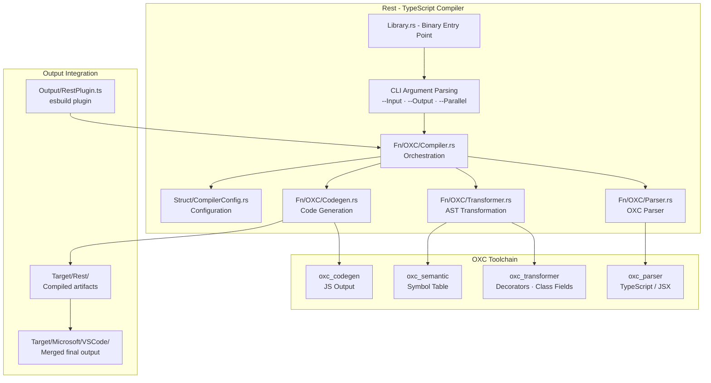
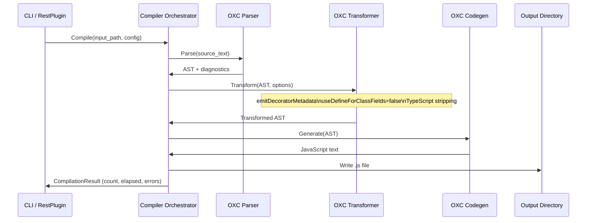

# Rest - Deep Dive

This document provides the technical foundation for the Rest TypeScript compiler
within the Land ecosystem. **Rest** is a Rust binary that uses the OXC toolchain
to compile TypeScript 2-3x faster than esbuild while producing output compatible
with VSCode's build process.

---

## Architecture

Rest is structured as a Rust library with a binary entry point. The compilation
pipeline passes source files through OXC's parser, transformer, and code
generator in sequence. An optional parallel mode processes multiple files
concurrently across CPU cores.

---

## Key Modules

| Path                              | Description                                                                 |
| :-------------------------------- | :-------------------------------------------------------------------------- |
| `Source/Library.rs`               | Binary entry point; parses CLI arguments and dispatches to compiler         |
| `Source/Fn/OXC/Compiler.rs`       | Main compilation orchestrator; coordinates parser, transformer, and codegen |
| `Source/Fn/OXC/Parser.rs`         | Wraps `oxc_parser` with error normalization and source tracking             |
| `Source/Fn/OXC/Transformer.rs`    | Applies TypeScript-to-JavaScript AST transformations including decorators   |
| `Source/Fn/OXC/Codegen.rs`        | Generates final JavaScript text from the transformed AST                    |
| `Source/Fn/Build.rs`              | Directory-based compilation: walks source trees preserving structure        |
| `Source/Fn/Bundle/`               | Bundling utilities for multi-file outputs                                   |
| `Source/Fn/NLS/`                  | Natural Language Support string extraction                                  |
| `Source/Fn/SWC/`                  | SWC integration shims (alternative transformer path)                        |
| `Source/Fn/Worker/`               | Worker thread support for parallel compilation                              |
| `Source/Struct/CompilerConfig.rs` | Configuration struct: decorator mode, class fields, source maps             |
| `Source/Struct/SWC.rs`            | SWC-specific configuration types                                            |

---

## Data Flow

When `--Parallel` is specified, the compiler fans out file compilation across
Tokio worker threads and collects aggregated metrics.

---

## Integration Points

| Connecting Element | Direction         | Mechanism                           | Description                                                                  |
| :----------------- | :---------------- | :---------------------------------- | :--------------------------------------------------------------------------- |
| **Output**         | Consumer          | Process invocation / esbuild plugin | Output's `RestPlugin.ts` invokes the Rest binary or calls it via plugin API  |
| **Cocoon**         | Indirect consumer | Compiled artifacts                  | Cocoon loads the JavaScript produced by Rest from `Target/Microsoft/VSCode/` |
| **Sky**            | Indirect consumer | `@codeeditorland/output` package    | Sky loads VSCode UI components compiled through the Rest pipeline            |

---

## Configuration

| Option             | CLI Flag / Variable | Default                  | Description                                                 |
| :----------------- | :------------------ | :----------------------- | :---------------------------------------------------------- |
| Input path         | `--Input`           | required                 | Directory or file to compile                                |
| Output path        | `--Output`          | required                 | Destination directory for compiled JavaScript               |
| Parallel mode      | `--Parallel`        | off                      | Enable multi-core parallel compilation                      |
| Decorator metadata | `CompilerConfig`    | `true`                   | Emit `emitDecoratorMetadata` for VSCode compatibility       |
| Class fields mode  | `CompilerConfig`    | `false` (VSCode default) | `useDefineForClassFields` - off matches VSCode's gulp build |
| Source maps        | `CompilerConfig`    | development only         | Inline source maps for debug builds                         |

The `CompilerConfig` struct is populated from either CLI flags or from the
esbuild plugin context when Rest is invoked as a plugin within the Output build
pipeline.
