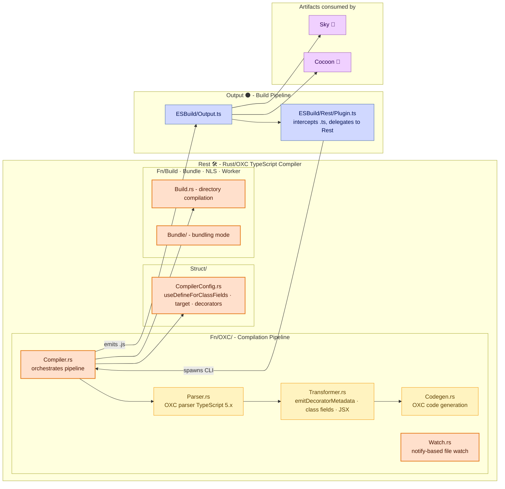

# **Rest** 🛠️

The High-Performance TypeScript Compiler for Land 🏞️

[](https://github.com/CodeEditorLand/Rest/blob/Current/LICENSE)
[](https://www.rust-lang.org/) [](https://crates.io/crates/Rest)
[](https://www.rust-lang.org/) [](https://www.rust-lang.org/)
[](https://oxc.rs/)

**[Rust API Documentation](https://rust.documentation.editor.land/Rest/)**

---

## Overview

Rest is a high-performance TypeScript compiler built with Rust and OXC, designed for 100% compatibility with VSCode's build process. It replaces esbuild's TypeScript loader with a Rust-powered compiler that produces VSCode-compatible output. VS Code's TypeScript build uses `tsc` with Node.js overhead on every incremental compile, with build times growing linearly with project size. Even alternatives like esbuild still run in a Node.js process. Rest delivers 2-3x faster compilation.

**Rest is engineered to:**

1. **Deliver High Performance:** Compile TypeScript 2-3x faster than esbuild using OXC.
2. **Ensure VSCode Compatibility:** Produce byte-for-byte identical output to VSCode's gulp build.
3. **Provide Memory Safety:** Leverage Rust's ownership model for deterministic performance without garbage collection.
4. **Support Modern Tooling:** Built on OXC 0.48, the latest TypeScript infrastructure.

### Why OXC over esbuild for TypeScript?

1. **OXC is used by VSCode internally.** Rest produces output that matches VSCode's own build pipeline — not an approximation.
2. **`emitDecoratorMetadata` support.** VSCode's codebase relies on decorator metadata emission. OXC handles this correctly; esbuild has limited support.
3. **`useDefineForClassFields = false`.** VSCode requires the legacy class fields behavior for ES5 compatibility. OXC's configurable codegen handles this exactly; esbuild's is implicit.

## Architecture



## Key Components

| Component | Path | Description |
| --------- | ---- | ----------- |
| Library (Entry) | `Source/Library.rs` | Binary entry point |
| OXC Compiler | `Source/Fn/OXC/Compiler.rs` | Main compiler orchestration |
| OXC Parser | `Source/Fn/OXC/Parser.rs` | OXC parser wrapper for TypeScript 5.x |
| OXC Transformer | `Source/Fn/OXC/Transformer.rs` | AST transformation (decorators, class fields, JSX) |
| OXC Codegen | `Source/Fn/OXC/Codegen.rs` | Code generation from transformed AST |
| Compiler Config | `Source/Struct/CompilerConfig.rs` | Advanced configuration (decorators, class fields, target) |
| Build Mode | `Source/Fn/Build/Build.rs` | Directory compilation |
| Bundle Mode | `Source/Fn/Bundle/` | Bundling mode |
| Watch | `Source/Watch.rs` | notify-based file watch |

## In the Land Project

Rest operates as the TypeScript compilation engine within the Output build pipeline. The RestPlugin (esbuild plugin) intercepts `.ts` files and delegates to the Rest CLI binary, which spawns the OXC-based compiler. Output artifacts flow to Sky and Cocoon. When `Compiler=Rest` is set, the Output element uses Rest instead of esbuild for TypeScript transpilation.

**Architecture Principles:** Performance (Rust + OXC delivers 2-3x faster compilation than esbuild), Compatibility (OXC is used by VSCode internally, ensuring 1:1 output), Memory Safety (no garbage collection, deterministic performance through Rust ownership), Modern Tooling (built on OXC 0.48+).

## Getting Started

### Installation

```toml
[dependencies]
Rest = { git = "https://github.com/CodeEditorLand/Rest.git", branch = "Current" }
```

Or use via the `Output` element's `Compiler=Rest` environment variable.

### Usage

The Rest compiler is invoked as a CLI binary:

```bash
# Compile a directory
rest --input ./Source --output ./Target

# With parallel compilation
rest --input ./Source --output ./Target --Parallel

# Check available options
rest --help
```

Via the Output element build pipeline:

```bash
# Use Rest compiler for TypeScript transpilation
export Compiler=Rest
npm run prepublishOnly

# Development mode with Rest
export NODE_ENV=development
export Compiler=Rest
npm run Run
```

### Key Features

- **Full TypeScript 5.x Support:** Complete compatibility with TypeScript 5.x syntax and features.
- **Decorator Handling:** Proper support for `emitDecoratorMetadata` and decorator transformations.
- **Class Fields Control:** Configurable `useDefineForClassFields` behavior (VSCode default: false).
- **Parallel Compilation:** Optional `--Parallel` flag for multi-core compilation.
- **Directory-Based Compilation:** Process entire directory structures with preserved layout.
- **Comprehensive Error Reporting:** Detailed error messages with source location information.
- **Compilation Metrics:** Built-in tracking of compilation count, elapsed time, and error counts.
- **Source Map Generation:** Planned support for source maps (in progress).

## API Reference

- [Rust API Documentation](https://rust.documentation.editor.land/Rest/)

## Related Documentation

- [Architecture Overview](https://Editor.Land/Doc/architecture)
- [Why Rust](https://Editor.Land/Doc/why-rust)
- [Output](https://github.com/CodeEditorLand/Output) — Build artifact pipeline
- [Cocoon](https://github.com/CodeEditorLand/Cocoon) — Node.js extension host

---

## Funding

This project is funded through [NGI0 Commons Fund](https://NLnet.NL/commonsfund), a fund established by [NLnet](https://NLnet.NL) with financial support from the European Commission's Next Generation Internet program, under grant agreement No 101135429.

The project is operated by PlayForm, based in Sofia, Bulgaria. PlayForm acts as the open-source steward for Code Editor Land under the NGI0 Commons Fund grant.

| | |
| --- | --- |
| [](https://Editor.Land) | [](https://PlayForm.Cloud) |
| [](https://NLnet.NL) | [](https://NLnet.NL/commonsfund) |
