<table>
<tr>
<td align="left" valign="middle">
<h3 align="left">Rest</h3>
</td>
<td align="left" valign="middle">
<h3 align="left">⛱️</h3>
</td>
<td align="left" valign="middle">
<h3 align="left">+</h3>
</td>
<td align="left" valign="middle">
<h3 align="left">
<a href="https://Editor.Land" target="_blank">
<picture>
<source media="(prefers-color-scheme: dark)" srcset="https://PlayForm.Cloud/Dark/Image/GitHub/Land.svg">
<source media="(prefers-color-scheme: light)" srcset="https://PlayForm.Cloud/Image/GitHub/Land.svg">

</picture>
</a>
</h3>
</td>
<td align="left" valign="middle">
<h3 align="left">
<a href="https://Editor.Land" target="_blank">
Land
</a>
</h3>
</td>
<td align="left" valign="middle">
<h3 align="left">🏞️</h3>
</td>
</tr>
</table>

---

# **Rest** ⛱️ The JavaScript/TypeScript Bundler for Land 🏞️

[](https://github.com/CodeEditorLand/Rest/tree/Current/LICENSE)
[](https://crates.io/crates/Rest)
[](https://www.rust-lang.org/)
[](https://oxc.rs/)

Welcome to **Rest**, the Rust-based JavaScript/TypeScript bundler and build system for the **Land Code Editor**. Rest leverages the **OXC (Oxidation Compiler)** ecosystem for ultra-fast parsing, transformation, and code generation of JavaScript and TypeScript code, with parallel processing via rayon and intelligent watch mode support.

**Rest** is engineered to:

1. **Provide Ultra-Fast Bundling**: Utilize OXC's Rust-based compiler for maximum-performance JavaScript/TypeScript transformation with 10-100x speedup over traditional tools.
2. **Enable Parallel Processing**: Leverage rayon for multi-threaded file processing and build group orchestration.
3. **Support Watch Mode**: Implement file system watching via notify for incremental development builds.
4. **Integrate with Git**: Provide Git repository operations for version tracking and change detection.

---

## Key Features 🔐

- **OXC Compiler Stack**: Leverages the OXC parser, transformer, and codegen for blazing-fast JavaScript/TypeScript transformation.
- **Parallel Processing**: Multi-threaded file processing using rayon for maximum throughput during builds.
- **Watch Mode**: File system watching via notify for incremental development builds with automatic recompilation.
- **Build Groups**: Organized build task grouping for complex project structures with multiple output targets.
- **Git Integration**: Built-in Git repository operations for version tracking and change detection during builds.

---

## OXC-Based Compilation  🚀

Rest uses the OXC (Oxidation Compiler) ecosystem, a high-performance JavaScript/TypeScript toolchain written in Rust. OXC provides:

- **`oxc_parser`**: Ultra-fast JavaScript/TypeScript parser with ESTree compatibility
- **`oxc_transformer`**: AST transformation engine supporting TypeScript, JSX, and modern ECMAScript features
- **`oxc_codegen`**: Efficient code generation from AST
- **`oxc_minifier`**: Production-ready minification with tree shaking
- **`oxc_semantic`**: Semantic analysis and symbol table construction

### OXC Compilation Flow

```mermaid
graph LR
    classDef input fill:#ddd,stroke:#666,stroke-dasharray: 5 5;
    classDef oxc fill:#f9f,stroke:#333,stroke-width:2px;
    classDef output fill:#9cf,stroke:#333,stroke-width:2px;

    Input[TypeScript Source]:::input --> Parser[OXC Parser]:::oxc
    Parser --> AST[Abstract Syntax Tree]:::oxc
    AST --> Transformer[OXC Transformer]:::oxc
    Transformer --> Semantic[Semantic Analysis]:::oxc
    Semantic --> Codegen[OXC Codegen]:::oxc
    Codegen --> Output[JavaScript Output]:::output
```



### The `Compiler` Environment Variable

Rest supports the `Compiler` environment variable to select the compilation backend:

```bash
# Use OXC compiler (default, recommended)
Compiler=OXC cargo run

# OXC provides 10-100x speedup over traditional TypeScript compiler
```

When `Compiler=OXC` is set, Rest uses the OXC-based compilation pipeline in [`Source/Fn/OXC/`](Source/Fn/OXC/).

---

## Core Architecture Principles 🏗️

| Principle | Description | Key Components Involved |
| :--------------------- | :-------------------------------------------------------------------------------------- | :------------------------------------------------ |
| **Performance** | Utilize Rust and OXC for maximum bundling speed with minimal overhead. | `OXC` compiler stack, `rayon` parallel processing |
| **Incremental Builds** | Support watch mode for efficient development workflows with only changed files rebuilt. | `notify` file watcher, incremental cache |
| **Modularity** | Organize builds into groups for clear separation of concerns and output targets. | Build Groups, task orchestration |
| **Git Awareness** | Integrate with Git for version tracking and change-aware builds. | `git2` crate, change detection |

---

## `Rest` in the Land Ecosystem  ⛱️ + 🏞️

| Component | Role & Key Responsibilities |
| :------------------------- | :---------------------------------------------------------------------------------------------- |
| **VSCode Source Consumer** | Reads and transforms VS Code platform code from `Microsoft/VSCode` and `CodeEditorLand/Editor`. |
| **Output Producer** | Generates bundled JavaScript artifacts consumed by `Cocoon` and `Sky`. |
| **Build Orchestrator** | Coordinates with `Maintain` for build configuration and execution. |

---

## Getting Started 🚀

### Prerequisites

- **Rust** 1.75 or higher
- **Node.js** 18.0 or higher (for NPM integration)

### Installation

To add `Rest` to your Rust project:

```toml
[dependencies]
Rest = { git = "https://github.com/CodeEditorLand/Rest.git", branch = "Current" }
```

Or install the CLI globally:

```sh
cargo install Rest
```

For NPM integration:

```sh
pnpm add @codeeditorland/rest
```

**Key Dependencies:**

- `oxc_*` crates: OXC compiler stack for JavaScript/TypeScript transformation
- `rayon`: Parallel processing for multi-threaded builds
- `notify`: File system watching for watch mode
- `git2`: Git repository operations
- `clap`: CLI argument parsing

---

## CLI Usage 📝

### Basic Usage

```sh
# Run with default options
Rest

# Use OXC compiler (default)
Compiler=OXC Rest

# Watch mode for development
Rest --watch

# Specify entry point
Rest --entry src/index.ts

# Specify output directory
Rest --output dist
```

### Environment Variable Compilation (VSCode Integration)

Rest is typically invoked through the build system with environment variables:

```bash
# Development build with OXC
pnpm cross-env \
  NODE_ENV=development \
  Bundle=true \
  Compile=false \
  Compiler=OXC \
  pnpm tauri build

# Production build
pnpm cross-env \
  NODE_ENV=production \
  Bundle=true \
  Compiler=OXC \
  pnpm tauri build
```

### VSCode Compilation Examples

**Development Mode:**

```bash
# Watch mode with hot reload
Compiler=OXC Rest --watch --entry Source/index.ts --output Target/
```

**Production Build:**

```bash
# Minified production build
Compiler=OXC Rest --minify --entry Source/index.ts --output Target/
```

**Build Groups:**

```bash
# Compile multiple entry points
Compiler=OXC Rest --group config/build-groups.json
```

---

## System Architecture Diagram 🏗️

This diagram illustrates `Rest`'s role in the Land build pipeline.


---

## Deep Dive & Component Breakdown 🔬

To understand how `Rest`'s internal components interact to provide the JavaScript/TypeScript bundling functionality, see the following source files:

### Core Modules

- **[`Source/Fn/OXC/`](Source/Fn/OXC/)** - OXC-based compiler implementation
  - [`Compiler.rs`](Source/Fn/OXC/Compiler.rs) - Main compiler orchestration
  - [`Parser.rs`](Source/Fn/OXC/Parser.rs) - OXC parser wrapper
  - [`Transformer.rs`](Source/Fn/OXC/Transformer.rs) - AST transformation
  - [`Codegen.rs`](Source/Fn/OXC/Codegen.rs) - Code generation
  - [`Compile.rs`](Source/Fn/OXC/Compile.rs) - Compilation entry point
  - [`Watch.rs`](Source/Fn/OXC/Watch.rs) - File system watching

- **[`Source/Fn/SWC/`](Source/Fn/SWC/)** - SWC-compatible interface (uses OXC backend)
  - [`mod.rs`](Source/Fn/SWC/mod.rs) - Module exports with legacy code commented out

### Build System

- **[`Source/Fn/Build/`](Source/Fn/Build/)** - Build group orchestration and task management
- **[`Source/Struct/Binary/`](Source/Struct/Binary/)** - CLI command structure
- **[`Source/Fn/Binary/`](Source/Fn/Binary/)** - Binary command implementations

### Support Modules

- **[`Source/Fn/Bundle/`](Source/Fn/Bundle/)** - Bundle configuration and esbuild integration
- **[`Source/Fn/Worker/`](Source/Fn/Worker/)** - Service worker compilation support
- **[`Source/Fn/NLS/`](Source/Fn/NLS/)** - Natural Language Support (i18n) bundling

The source files explain the OXC compiler stack integration, parallel processing with rayon, and the build group configuration system.

---

## Development Tools 🔧

This project leverages the **Depth-Aware Skill System** for efficient development workflows. The system adapts skill behavior based on usage frequency, providing quick initial checks and progressively more comprehensive analysis.

### Quick Start with Skills

- **Level 1 (First Run):** Quick scan - fastest execution, focused scope
- **Level 2 (Second Run):** Detailed analysis - broader coverage
- **Level 3 (Third Run):** Deep dive - comprehensive review
- **Level 4 (Fourth+ Run):** Strategic analysis - system-wide patterns

For detailed guidance on using the depth-aware skill system, see:
- [`Documentation/SkillSystem.md`](../../Documentation/SkillSystem.md) - Complete system overview
- [`.roo/skills/DEPTH-MANAGEMENT.md`](../../.roo/skills/DEPTH-MANAGEMENT.md) - Technical management guide

### Common Development Tasks

| Task | Command | Depth Level |
|------|---------|-------------|
| Quick emoji check | `preformat-readme-emoji` | Level 1 |
| Full documentation scan | `postformat-pascalcase` | Level 3 |
| Architecture review | `knowledge-element-architecture` | Level 4 |

---

## Contributing 🤝

We welcome contributions! Please see our [`CONTRIBUTING.md`](CONTRIBUTING.md) for details on how to get started.

### Development Setup

```sh
# Clone the repository
git clone https://github.com/CodeEditorLand/Rest.git
cd Rest

# Build the project
cargo build

# Run tests
cargo test

# Run with OXC compiler
Compiler=OXC cargo run
```

### Code Style

- Follow Rust naming conventions (snake_case for functions/variables, PascalCase for types)
- Use `tracing` for diagnostic logging instead of `println!`
- Ensure all public APIs have documentation comments
- Run `cargo fmt` and `cargo clippy` before submitting PRs

---

## Changelog 📜

See [`CHANGELOG.md`](https://github.com/CodeEditorLand/Rest/tree/Current/) for a history of changes to this CLI.

---

## License ⚖️

This project is released into the public domain under the **Creative Commons CC0 Universal** license. You are free to use, modify, distribute, and build upon this work for any purpose, without any restrictions. For the full legal text, see the [`LICENSE`](https://github.com/CodeEditorLand/Rest/tree/Current/) file.

---

## Funding & Acknowledgements 🙏🏻

**Rest** is a core element of the **Land** ecosystem. This project is funded through [NGI0 Commons Fund](https://NLnet.NL/commonsfund), a fund established by [NLnet](https://NLnet.NL) with financial support from the European Commission's [Next Generation Internet](https://ngi.eu) program. Learn more at the [NLnet project page](https://NLnet.NL/project/Land).

<table>
<thead>
<tr>
<th align="left"><strong>Land</strong></th>
<th align="left"><strong>PlayForm</strong></th>
<th align="left"><strong>NLnet</strong></th>
<th align="left"><strong>NGI0 Commons Fund</strong></th>
</tr>
</thead>
<tbody>
<tr>
<td align="left" valign="middle">
<a href="https://Editor.Land">

</a>
</td>
<td align="left" valign="middle">
<a href="https://PlayForm.Cloud">

</a>
</td>
<td align="left" valign="middle">
<a href="https://NLnet.NL">

</a>
</td>
<td align="left" valign="middle">
<a href="https://NLnet.NL/commonsfund">

</a>
</td>
</tr>
</tbody>
</table>

---

**Project Maintainers**: Source Open
([Source/Open@Editor.Land](mailto:Source/Open@Editor.Land)) |
[GitHub Repository](https://github.com/CodeEditorLand/Rest) |
[Report an Issue](https://github.com/CodeEditorLand/Rest/issues) |
[Security Policy](https://github.com/CodeEditorLand/Rest/security/policy)
