# **Rest**&#x2001;🛠️

<table>
	<tr>
		<td>
			<a href="https://GitHub.Com/CodeEditorLand/Rest" target="_blank">
				<picture>
					<source media="(prefers-color-scheme: dark)" srcset="https://img.shields.io/github/last-commit/CodeEditorLand/Rest?label=Last-commit&color=black&labelColor=black&logoColor=white&logoWidth=0" />
					<source media="(prefers-color-scheme: light)" srcset="https://img.shields.io/github/last-commit/CodeEditorLand/Rest?label=Last-commit&color=white&labelColor=white&logoColor=black&logoWidth=0" />
					
				</picture>
			</a>
			<br />
			<a href="https://GitHub.Com/CodeEditorLand/Rest" target="_blank">
				<picture>
					<source media="(prefers-color-scheme: dark)" srcset="https://img.shields.io/github/issues/CodeEditorLand/Rest?label=Issues&color=black&labelColor=black&logoColor=white&logoWidth=0" />
					<source media="(prefers-color-scheme: light)" srcset="https://img.shields.io/github/issues/CodeEditorLand/Rest?label=Issues&color=white&labelColor=white&logoColor=black&logoWidth=0" />
					
				</picture>
			</a>
		</td>
		<td>
			<a href="https://github.com/CodeEditorLand/Rest" target="_blank">
				<picture>
					<source media="(prefers-color-scheme: dark)" srcset="https://img.shields.io/github/stars/CodeEditorLand/Rest?style=flat&label=Star&logo=github&color=black&labelColor=black&logoColor=white&logoWidth=0" />
					<source media="(prefers-color-scheme: light)" srcset="https://img.shields.io/github/stars/CodeEditorLand/Rest?style=flat&label=Star&logo=github&color=white&labelColor=white&logoColor=black&logoWidth=0" />
					
				</picture>
			</a>
			<br />
			<a href="https://GitHub.Com/CodeEditorLand/Rest" target="_blank">
				<picture>
					<source media="(prefers-color-scheme: dark)" srcset="https://img.shields.io/github/downloads/CodeEditorLand/Rest?label=Downloads&color=black&labelColor=black&logoColor=white&logoWidth=0" />
					<source media="(prefers-color-scheme: light)" srcset="https://img.shields.io/github/downloads/CodeEditorLand/Rest?label=Downloads&color=white&labelColor=white&logoColor=black&logoWidth=0" />
					
				</picture>
			</a>
		</td>
	</tr>
</table>

The HTTP/REST API Server for Land&#x2001;🏞️

[](https://github.com/CodeEditorLand/Rest/blob/Current/LICENSE)
[](https://www.rust-lang.org/)&#x2001;[](https://crates.io/crates/Rest)
[](https://www.rust-lang.org/)&#x2001;[](https://www.rust-lang.org/)

**[Rust API Documentation](https://rust.documentation.rest.editor.land/)**&#x2001;📖

---

## Overview

**Rest** is the HTTP/REST API server for the **Land** Code Editor. It provides
the backend API layer that serves the Land web application — handling HTTP
requests, routing, and server-side logic through `Fn/` handlers backed by
`Struct/` data types. Rest is built in `Rust` with performance and reliability
as first-class priorities.

**Rest is engineered to:**

1. **Serve the Land API** — Handle HTTP requests with Rust-native performance
   and type-safe routing.
2. **Provide Structured Data Types** — Define request/response schemas through
   `Struct/` for compile-time safety.
3. **Enable Modular Handlers** — Organize API logic into composable `Fn/`
   handler modules for maintainability.
4. **Integrate with Land Architecture** — Work alongside `Maintain`, `Cocoon`,
   and other elements as the HTTP gateway for the Land ecosystem.

---

## Key Features&#x2001;🔧

**Type-Safe API Layer** — Request and response types defined in `Struct/`
provide compile-time validation of the entire API surface. Every endpoint is
schema-checked before it reaches production.

**Modular Handler Architecture** — API logic is decomposed into `Fn/` handler
modules, each responsible for a specific domain. Handlers are composable,
testable, and independently maintainable.

**Rust-Native Performance** — Built on `Rust` with zero-cost abstractions.
No garbage collection, no runtime overhead — just predictable, fast HTTP
request handling.

**Land Integration** — Connects directly with `Maintain` for maintenance
operations, `Cocoon` for extension host services, and other Land elements
through the unified API layer.

**Comprehensive Error Handling** — Structured error types with detailed
reporting ensure failures are traceable and debuggable.

---

## Core Architecture Principles&#x2001;🏗️

| Principle | Description | Key Components |
|-----------|-------------|----------------|
| **Handler Modularity** | API logic is decomposed into focused `Fn/` handler modules, each responsible for a single domain. Handlers are composable and independently testable. | `Fn/*` |
| **Type Safety** | Request/response schemas live in `Struct/` for compile-time validation. Every endpoint is schema-checked. | `Struct/*` |
| **Performance First** | Rust-native HTTP handling with zero-cost abstractions and no runtime overhead. | `Source/Library.rs`, `Source/Main.rs` |
| **Land Composability** | Integrates with `Maintain`, `Cocoon`, and other elements as the HTTP gateway for the Land ecosystem. | `Fn/` handlers |

---

## System Architecture&#x2001;

```mermaid
graph LR
    classDef rest     fill:#ffe0cc,stroke:#e67e22,stroke-width:2px,color:#4a1500;
    classDef handler  fill:#d0d8ff,stroke:#4a6fa5,stroke-width:2px,color:#001050;
    classDef struct   fill:#d4f5d4,stroke:#27ae60,stroke-width:2px,color:#0a3a0a;
    classDef external fill:#f0d0ff,stroke:#9b59b6,stroke-width:1px,stroke-dasharray:5 5,color:#2c0050;

    subgraph REST["Rest 🛠️ - HTTP/REST API Server"]
        direction TB
        subgraph HANDLERS["Fn/ - API Handlers"]
            BuildHandler["Build.rs&#x2001;🏗️&#x2001;directory compilation API"]:::handler
            BundleHandler["Bundle/&#x2001;📦&#x2001;bundling endpoint"]:::handler
            NLSHandler["NLS/&#x2001;🔍&#x2001;language service API"]:::handler
            WorkerHandler["Worker/&#x2001;⚙️&#x2001;compilation worker API"]:::handler
            SWCHandler["SWC/&#x2001;🔄&#x2001;SWC compiler endpoints"]:::handler
            OXCHandler["OXC/&#x2001;⚡&#x2001;OXC compiler endpoints"]:::handler
            TransformHandler["Transform/&#x2001;🔀&#x2001;AST transformation API"]:::handler
            BinaryHandler["Binary/&#x2001;💻&#x2001;binary command execution"]:::handler
        end
        subgraph STRUCTS["Struct/ - Data Types"]
            CompilerCfg["CompilerConfig.rs&#x2001;⚙️&#x2001;compiler configuration"]:::struct
            SWC["SWC.rs&#x2001;🔄&#x2001;SWC type definitions"]:::struct
            BinaryCmd["Binary/Command/&#x2001;📋&#x2001;CLI argument types"]:::struct
        end
        Entry["Library.rs&#x2001;📚&#x2001;library entry"]:::rest
        BinaryEntry["Main.rs&#x2001;🚀&#x2001;binary entry"]:::rest
        Entry --> HANDLERS
        Entry --> STRUCTS
        BinaryEntry --> BinaryHandler
    end

    subgraph EXTERNAL["Land Ecosystem"]
        Maintain["Maintain 🔧"]:::external
        Cocoon["Cocoon 🦋"]:::external
    end

    REST -- HTTP API --> Maintain
    REST -- HTTP API --> Cocoon
```



**Connection paths:**

| Path | Protocol | Use Case |
|------|----------|----------|
| Rest → Maintain | HTTP/REST | Maintenance operations API |
| Rest → Cocoon | HTTP/REST | Extension host services API |
| Client → Rest | HTTP | Land web application API gateway |

---

## Key Components

| Component | Path | Description |
|-----------|------|-------------|
| Library (Entry) | `Source/Library.rs` | Library root — `rlib`, `cdylib`, and `staticlib` targets |
| Binary Entry | `Source/Main.rs` | CLI binary entry point |
| OXC Compiler | `Source/Fn/OXC/Compiler.rs` | Main OXC-based compiler orchestration |
| OXC Parser | `Source/Fn/OXC/Parser.rs` | OXC parser wrapper for TypeScript 5.x |
| OXC Transformer | `Source/Fn/OXC/Transformer.rs` | AST transformation (decorators, class fields, JSX) |
| OXC Codegen | `Source/Fn/OXC/Codegen.rs` | Code generation from transformed AST |
| OXC Compile | `Source/Fn/OXC/Compile.rs` | Full OXC compilation pipeline |
| OXC Watch | `Source/Fn/OXC/Watch.rs` | Watch mode for OXC compilation |
| SWC Compiler | `Source/Fn/SWC/Compile.rs` | SWC-based compilation pipeline |
| SWC Watch | `Source/Fn/SWC/Watch.rs` | Watch mode for SWC compilation |
| Build Mode | `Source/Fn/Build.rs` | Directory compilation handler |
| Bundle Mode | `Source/Fn/Bundle/` | Bundling endpoints (Builder, Config, ESBuild) |
| NLS | `Source/Fn/NLS/` | Language service API (Extract, Replace, Bundle) |
| Worker | `Source/Fn/Worker/` | Compilation worker (Bootstrap, Compile, Detect) |
| Transform | `Source/Fn/Transform/` | AST transformation (PrivateField) |
| Binary Commands | `Source/Fn/Binary/Command/` | CLI command handlers (Sequential, Parallel, Entry) |
| Compiler Config | `Source/Struct/CompilerConfig.rs` | Compiler configuration types |
| SWC Types | `Source/Struct/SWC.rs` | SWC-related type definitions |
| Binary Command Types | `Source/Struct/Binary/Command/` | CLI argument and option types |

---

## Project Structure&#x2001;🗺️

```
Element/Rest/
├── Source/
│   ├── Library.rs              # Library root (rlib + cdylib + staticlib)
│   ├── Main.rs                 # Binary entry point (CLI)
│   ├── Binary.rs               # Binary initialization
│   ├── Fn/                     # API handler modules
│   │   ├── mod.rs              # Module re-exports
│   │   ├── Build.rs            # Directory compilation endpoint
│   │   ├── Bundle/             # Bundling API
│   │   │   ├── mod.rs
│   │   │   ├── Builder.rs      # Bundle builder
│   │   │   ├── Config.rs       # Bundle configuration
│   │   │   └── ESBuild.rs      # ESBuild integration
│   │   ├── NLS/                # Language service endpoints
│   │   │   ├── mod.rs
│   │   │   ├── Extract.rs      # NLS extraction
│   │   │   ├── Replace.rs      # NLS replacement
│   │   │   └── Bundle.rs       # NLS bundling
│   │   ├── Worker/             # Compilation worker API
│   │   │   ├── mod.rs
│   │   │   ├── Bootstrap.rs    # Worker initialization
│   │   │   ├── Compile.rs      # Worker compilation
│   │   │   └── Detect.rs       # Worker detection
│   │   ├── OXC/                # OXC compiler endpoints
│   │   │   ├── mod.rs
│   │   │   ├── Compiler.rs     # Compiler orchestration
│   │   │   ├── Parser.rs       # OXC parser wrapper
│   │   │   ├── Transformer.rs  # AST transformation
│   │   │   ├── Codegen.rs      # Code generation
│   │   │   ├── Compile.rs      # Compilation pipeline
│   │   │   └── Watch.rs        # Watch mode
│   │   ├── SWC/                # SWC compiler endpoints
│   │   │   ├── mod.rs
│   │   │   ├── Compile.rs      # SWC compilation
│   │   │   └── Watch/          # SWC watch mode
│   │   │       └── Compile.rs
│   │   ├── Transform/          # Transformation endpoints
│   │   │   ├── mod.rs
│   │   │   └── PrivateField.rs # Private field transforms
│   │   └── Binary/             # Binary command handlers
│   │       ├── mod.rs
│   │       ├── Command.rs      # Command dispatcher
│   │       └── Command/        # Command implementations
│   │           ├── Entry.rs    # Entry command
│   │           ├── Sequential.rs # Sequential execution
│   │           └── Parallel.rs   # Parallel execution
│   └── Struct/                 # Data type definitions
│       ├── mod.rs
│       ├── CompilerConfig.rs   # Compiler configuration schema
│       ├── SWC.rs              # SWC type definitions
│       └── Binary/             # Binary command types
│           ├── mod.rs
│           ├── Command.rs      # Command argument types
│           └── Command/        # Command option types
│               ├── Option.rs
│               └── Entry.rs
└── Documentation/
    └── Rust/
        └── doc/                # Cargo doc output
```

---

## In the Land Project

Rest serves as the HTTP/REST API server for the Land ecosystem, providing the
backend API layer that the Land web application communicates with. It handles
HTTP requests through `Fn/` handler modules, backed by `Struct/` type-safe
data definitions.

**Architecture Principles:** Handler Modularity (API logic is decomposed into
focused `Fn/` handler modules), Type Safety (compile-time validation through
`Struct/` schemas), Performance (Rust-native HTTP handling with zero-cost
abstractions), Land Integration (connects with `Maintain` and `Cocoon` as
the HTTP gateway).

---

## Getting Started&#x2001;🚀

### Prerequisites

- **Rust** 1.75 or later

### Build

```bash
cd Element/Rust
cargo build --release
```

### As a Library

```toml
[dependencies]
Rest = { git = "https://github.com/CodeEditorLand/Rest.git", branch = "Current" }
```

---

## Compatibility

Rest is designed to be compatible with:

| Target | Integration |
|--------|-------------|
| **Maintain** | HTTP/REST API for maintenance operations |
| **Cocoon** | HTTP/REST API for extension host services |
| **Land Web App** | Primary HTTP gateway for the Land frontend |

---

## API Reference

- **[Rust API Documentation](https://rust.documentation.rest.editor.land/)**&#x2001;📖

---

## Related Documentation

- [Architecture Overview](https://Editor.Land/Doc/architecture) — Land system architecture
- [Why Rust](https://Editor.Land/Doc/why-rust) — Why Rust for Land infrastructure
- [Maintain](https://github.com/CodeEditorLand/Maintain) — Maintenance operations
- [Cocoon](https://github.com/CodeEditorLand/Cocoon) — `Node.js`/`Effect-TS` extension host

---

## Funding & Acknowledgements&#x2001;🙏🏻

This project is funded through
[NGI0 Commons Fund](https://NLnet.NL/commonsfund), a fund established by
[NLnet](https://NLnet.NL) with financial support from the European Commission's
Next Generation Internet program, under grant agreement No 101135429.

The project is operated by PlayForm, based in Sofia, Bulgaria. PlayForm acts as
the open-source steward for Code Editor Land under the NGI0 Commons Fund grant.

<table>
	<tbody>
		<tr>
			<td align="left" valign="middle">
				<a href="https://Editor.Land">
					
				</a>
			</td>
			<td align="left" valign="middle">
				<a href="https://PlayForm.Cloud">
					
				</a>
			</td>
			<td align="left" valign="middle">
				<a href="https://NLnet.NL">
					
				</a>
			</td>
			<td align="left" valign="middle">
				<a href="https://NLnet.NL/commonsfund">
					
				</a>
			</td>
		</tr>
	</tbody>
</table>
