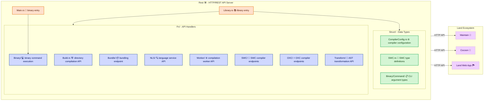

# **Rest**&#x2001;🛠️

<table>
	<tr>
		<td>
			<a href="https://GitHub.Com/CodeEditorLand/Rest" target="_blank">
				<picture>
					<source media="(prefers-color-scheme: dark)" srcset="https://img.shields.io/github/last-commit/CodeEditorLand/Rest?label=Last-commit&color=black&labelColor=black&logoColor=white&logoWidth=0" />
					<source media="(prefers-color-scheme: light)" srcset="https://img.shields.io/github/last-commit/CodeEditorLand/Rest?label=Last-commit&color=white&labelColor=white&logoColor=black&logoWidth=0" />
					
				</picture>
			</a>
			<br />
			<a href="https://GitHub.Com/CodeEditorLand/Rest" target="_blank">
				<picture>
					<source media="(prefers-color-scheme: dark)" srcset="https://img.shields.io/github/issues/CodeEditorLand/Rest?label=Issues&color=black&labelColor=black&logoColor=white&logoWidth=0" />
					<source media="(prefers-color-scheme: light)" srcset="https://img.shields.io/github/issues/CodeEditorLand/Rest?label=Issues&color=white&labelColor=white&logoColor=black&logoWidth=0" />
					
				</picture>
			</a>
		</td>
		<td>
			<a href="https://github.com/CodeEditorLand/Rest" target="_blank">
				<picture>
					<source media="(prefers-color-scheme: dark)" srcset="https://img.shields.io/github/stars/CodeEditorLand/Rest?style=flat&label=Star&logo=github&color=black&labelColor=black&logoColor=white&logoWidth=0" />
					<source media="(prefers-color-scheme: light)" srcset="https://img.shields.io/github/stars/CodeEditorLand/Rest?style=flat&label=Star&logo=github&color=white&labelColor=white&logoColor=black&logoWidth=0" />
					
				</picture>
			</a>
			<br />
			<a href="https://GitHub.Com/CodeEditorLand/Rest" target="_blank">
				<picture>
					<source media="(prefers-color-scheme: dark)" srcset="https://img.shields.io/github/downloads/CodeEditorLand/Rest?label=Downloads&color=black&labelColor=black&logoColor=white&logoWidth=0" />
					<source media="(prefers-color-scheme: light)" srcset="https://img.shields.io/github/downloads/CodeEditorLand/Rest?label=Downloads&color=white&labelColor=white&logoColor=black&logoWidth=0" />
					
				</picture>
			</a>
		</td>
	</tr>
</table>

The HTTP/REST API Server for Land&#x2001;🏞️

> **The Land editor needs to compile `TypeScript` and `JavaScript` with
> predictable, high-performance results. Without a dedicated compilation API,
> each build tool reinvents parsing, transformation, and codegen - leading to
> inconsistent output, duplicated work, and poor iteration times.**

_"One compilation server, two battle-tested engines (`OXC` and `SWC`), zero
wasted cycles."_

[](https://github.com/CodeEditorLand/Rest/blob/Current/LICENSE)
[](https://www.rust-lang.org/)&#x2001;[](https://crates.io/crates/Rest)
[](https://www.rust-lang.org/)&#x2001;[](https://www.rust-lang.org/)

**[Rust API Documentation](https://rust.documentation.rest.editor.land/)**&#x2001;📖

---

## Overview

**Rest** is the HTTP/REST API server for the **Land** Code Editor. It provides
the backend compilation and build API layer that serves the Land web application
- orchestrating `OXC` and `SWC` compiler pipelines, handling
`TypeScript`/`JavaScript` transformation, bundling via `ESBuild`, and language
service operations through `Fn/` handler modules backed by `Struct/` data types.

Rest was originally designed as a `TypeScript` compiler but has been rebranded
as the unified compilation API server. It uses two compiler backends - `OXC`
(Oxidation Compiler) for fast `TypeScript` 5.x parsing, transformation, and code
generation, and `SWC` (Speedy Web Compiler) as an alternative pipeline. Both
backends share the same API surface through the `Fn/` handler layer, making them
interchangeable for different compilation workloads.

**Rest is engineered to:**

1. **Provide a Unified Compilation API** - Expose `OXC` and `SWC` compilation
   pipelines through a consistent HTTP/REST interface with structured
   request/response types.
2. **Enable Fast TypeScript Transformation** - Leverage `OXC`'s parser,
   transformer, and codegen for `TypeScript` 5.x with decorator and JSX support,
   plus `SWC` as a fallback pipeline.
3. **Support Build Workflows** - Handle directory compilation, `ESBuild`
   bundling, NLS (Native Language Service) extraction and replacement, and
   compilation worker management.
4. **Integrate with Land Architecture** - Serve as the compilation backend for
   `Maintain` (build system), `Cocoon` (extension host compilation), and the
   Land web application through a type-safe HTTP API.

---

## Key Features&#x2001;🔧

**Dual Compiler Backends** - `OXC` (`Source/Fn/OXC/`) and `SWC`
(`Source/Fn/SWC/`) run side-by-side behind the same API. `OXC` handles
`TypeScript` 5.x parsing, AST transformation (decorators, class fields, JSX),
and code generation. `SWC` provides an alternative compilation pipeline with its
own watch mode.

**Type-Safe API Layer** - Request and response types defined in `Struct/`
provide compile-time validation of the entire API surface. Every endpoint is
schema-checked before it reaches production through `Rust`'s type system.

**Modular Handler Architecture** - API logic is decomposed into `Fn/` handler
modules (`Build`, `Bundle`, `NLS`, `Worker`, `OXC`, `SWC`, `Transform`,
`Binary`) each responsible for a single compilation domain. Handlers are
composable, testable, and independently maintainable.

**`ESBuild` Bundling** - Integration with `ESBuild` via
`Source/Fn/Bundle/ESBuild.rs` for fast production bundling with configurable
build profiles through `Source/Fn/Bundle/Config.rs`.

**Native Language Service** - NLS endpoints (`Source/Fn/NLS/`) provide
extraction, replacement, and bundling of native language strings for
internationalization workflows.

**Compilation Workers** - Dedicated worker lifecycle management
(`Source/Fn/Worker/`) with bootstrap, compilation, and capability detection for
parallel compilation across multiple cores.

**Watch Mode** - Both `OXC` and `SWC` backends support file-system watch mode
via `Source/Fn/OXC/Watch.rs` and `Source/Fn/SWC/Watch/` for incremental
recompilation on file changes.

---

## Core Architecture Principles&#x2001;🏗️

| Principle                  | Description                                                                                                                                                         | Key Components                                                                                  |
| -------------------------- | ------------------------------------------------------------------------------------------------------------------------------------------------------------------- | ----------------------------------------------------------------------------------------------- |
| **Handler Modularity**     | API logic is decomposed into focused `Fn/` handler modules, each responsible for a single compilation domain. Handlers are composable and independently testable.   | `Fn/Build`, `Fn/Bundle`, `Fn/NLS`, `Fn/Worker`, `Fn/OXC`, `Fn/SWC`, `Fn/Transform`, `Fn/Binary` |
| **Type Safety**            | Request/response schemas live in `Struct/` for compile-time validation. Every endpoint is schema-checked through `Rust`'s type system.                              | `Struct/CompilerConfig`, `Struct/SWC`, `Struct/Binary`                                          |
| **Dual Compiler Strategy** | `OXC` and `SWC` run side-by-side behind the same API surface. The handler layer abstracts compiler selection so callers don't need to know which backend is active. | `Fn/OXC/Compiler`, `Fn/SWC/Compile`                                                             |
| **Performance First**      | `Rust`-native HTTP handling with zero-cost abstractions and parallel compilation via `rayon` for multi-core throughput.                                             | `Source/Library.rs`, `Source/Main.rs`, `Fn/Binary/Command/Parallel`                             |

---

## System Architecture&#x2001;



**Connection paths:**

| Path                | Protocol    | Use Case                                          |
| ------------------- | ----------- | ------------------------------------------------- |
| Rest → Maintain     | HTTP/REST   | Compilation and build operations API              |
| Rest → Cocoon       | HTTP/REST   | Extension host compilation services               |
| Land Web App → Rest | HTTP        | Primary compilation API gateway                   |
| Rest → OXC Compiler | Direct call | `TypeScript` 5.x parsing, transformation, codegen |
| Rest → SWC Compiler | Direct call | Alternative compilation pipeline                  |

---

## Key Components

| Component              | Path                                  | Description                                              |
| ---------------------- | ------------------------------------- | -------------------------------------------------------- |
| Library (Entry)        | `Source/Library.rs`                   | Library root - `rlib`, `cdylib`, and `staticlib` targets |
| Binary Entry           | `Source/Main.rs`                      | CLI binary entry point                                   |
| OXC Compiler           | `Source/Fn/OXC/Compiler.rs`           | Main OXC-based compiler orchestration                    |
| OXC Parser             | `Source/Fn/OXC/Parser.rs`             | OXC parser wrapper for `TypeScript` 5.x                  |
| OXC Transformer        | `Source/Fn/OXC/Transformer.rs`        | AST transformation (decorators, class fields, JSX)       |
| OXC Codegen            | `Source/Fn/OXC/Codegen.rs`            | Code generation from transformed AST                     |
| OXC Compile            | `Source/Fn/OXC/Compile.rs`            | Full OXC compilation pipeline                            |
| OXC Watch              | `Source/Fn/OXC/Watch.rs`              | Watch mode for OXC compilation                           |
| SWC Compiler           | `Source/Fn/SWC/Compile.rs`            | SWC-based compilation pipeline                           |
| SWC Watch              | `Source/Fn/SWC/Watch.rs`              | Watch mode for SWC compilation                           |
| Build Mode             | `Source/Fn/Build.rs`                  | Directory compilation handler                            |
| Bundle Builder         | `Source/Fn/Bundle/Builder.rs`         | Bundle builder orchestration                             |
| Bundle Config          | `Source/Fn/Bundle/Config.rs`          | Bundle configuration profiles                            |
| ESBuild                | `Source/Fn/Bundle/ESBuild.rs`         | `ESBuild` integration for fast bundling                  |
| NLS Extract            | `Source/Fn/NLS/Extract.rs`            | NLS string extraction                                    |
| NLS Replace            | `Source/Fn/NLS/Replace.rs`            | NLS string replacement                                   |
| NLS Bundle             | `Source/Fn/NLS/Bundle.rs`             | NLS bundling                                             |
| Worker Bootstrap       | `Source/Fn/Worker/Bootstrap.rs`       | Worker initialization                                    |
| Worker Compile         | `Source/Fn/Worker/Compile.rs`         | Worker compilation                                       |
| Worker Detect          | `Source/Fn/Worker/Detect.rs`          | Worker capability detection                              |
| Transform PrivateField | `Source/Fn/Transform/PrivateField.rs` | Private field AST transforms                             |
| Binary Commands        | `Source/Fn/Binary/Command/`           | CLI command handlers (Sequential, Parallel, Entry)       |
| Compiler Config        | `Source/Struct/CompilerConfig.rs`     | Compiler configuration types                             |
| SWC Types              | `Source/Struct/SWC.rs`                | SWC-related type definitions                             |
| Binary Command Types   | `Source/Struct/Binary/Command/`       | CLI argument and option types                            |

---

## Project Structure&#x2001;🗺️

```
Element/Rest/
├── Source/
│   ├── Library.rs              # Library root (rlib + cdylib + staticlib)
│   ├── Main.rs                 # Binary entry point (CLI)
│   ├── Binary.rs               # Binary initialization
│   ├── Fn/                     # API handler modules
│   │   ├── mod.rs              # Module re-exports
│   │   ├── Build.rs            # Directory compilation endpoint
│   │   ├── Bundle/             # Bundling API
│   │   │   ├── mod.rs
│   │   │   ├── Builder.rs      # Bundle builder
│   │   │   ├── Config.rs       # Bundle configuration
│   │   │   └── ESBuild.rs      # ESBuild integration
│   │   ├── NLS/                # Native Language Service endpoints
│   │   │   ├── mod.rs
│   │   │   ├── Bundle.rs       # NLS bundling
│   │   │   ├── Extract.rs      # NLS extraction
│   │   │   └── Replace.rs      # NLS replacement
│   │   ├── Worker/             # Compilation worker API
│   │   │   ├── mod.rs
│   │   │   ├── Bootstrap.rs    # Worker initialization
│   │   │   ├── Compile.rs      # Worker compilation
│   │   │   └── Detect.rs       # Worker capability detection
│   │   ├── OXC/                # OXC compiler endpoints
│   │   │   ├── mod.rs
│   │   │   ├── Codegen.rs      # Code generation
│   │   │   ├── Compile.rs      # Compilation pipeline
│   │   │   ├── Compiler.rs     # Compiler orchestration
│   │   │   ├── Parser.rs       # OXC parser wrapper
│   │   │   ├── Transformer.rs  # AST transformation
│   │   │   └── Watch.rs        # Watch mode
│   │   ├── SWC/                # SWC compiler endpoints
│   │   │   ├── mod.rs
│   │   │   ├── Compile.rs      # SWC compilation
│   │   │   └── Watch/          # SWC watch mode
│   │   │       └── Compile.rs
│   │   ├── Transform/          # AST transformation endpoints
│   │   │   ├── mod.rs
│   │   │   └── PrivateField.rs # Private field transforms
│   │   └── Binary/             # Binary command handlers
│   │       ├── mod.rs
│   │       ├── Command.rs      # Command dispatcher
│   │       └── Command/        # Command implementations
│   │           ├── Entry.rs    # Entry command
│   │           ├── Parallel.rs # Parallel execution
│   │           └── Sequential.rs # Sequential execution
│   └── Struct/                 # Data type definitions
│       ├── mod.rs
│       ├── CompilerConfig.rs   # Compiler configuration schema
│       ├── SWC.rs              # SWC type definitions
│       └── Binary/             # Binary command types
│           ├── mod.rs
│           ├── Command.rs      # Command argument types
│           └── Command/        # Command option types
│               ├── Entry.rs
│               └── Option.rs
└── Documentation/
    └── Rust/
        └── doc/                # Cargo doc output
```

---

## In the Land Project

Rest serves as the HTTP/REST API server for the Land ecosystem, providing the
compilation and build API layer that the Land web application communicates with.
It handles HTTP requests through `Fn/` handler modules, orchestrates `OXC` and
`SWC` compiler pipelines, and backs all operations with `Struct/` type-safe data
definitions.

Rest is the compilation backend for the broader Land toolchain:

| Consumer            | Role              | Integration                                                              |
| ------------------- | ----------------- | ------------------------------------------------------------------------ |
| **Maintain** 🔧     | Build system      | Compilation, dead-code elimination, and build orchestration via HTTP API |
| **Cocoon** 🦋       | Extension host    | Extension compilation and transformation via HTTP API                    |
| **Land Web App** 🏞️ | Frontend          | Primary compilation gateway for the web-based editor                     |
| **Air** 🪁          | Background daemon | Background compilation and watch-mode coordination                       |

Rest depends on `Common` 🧩 for shared type definitions and utility functions
used across the Land Rust infrastructure.

---

## Getting Started&#x2001;🚀

### Prerequisites

- **Rust** 1.75 or later

### Build

```bash
cd Element/Rest
cargo build --release
```

### Key Dependencies

| Dependency        | Purpose                                            |
| ----------------- | -------------------------------------------------- |
| `oxc_parser`      | `TypeScript`/`JavaScript` parsing                  |
| `oxc_transformer` | AST transformation (decorators, JSX, class fields) |
| `oxc_codegen`     | Code generation from transformed AST               |
| `oxc_minifier`    | Code minification                                  |
| `oxc_semantic`    | Semantic analysis and type checking                |
| `oxc_ast`         | AST type definitions                               |
| `rayon`           | Parallel compilation across CPU cores              |
| `tokio`           | Async runtime for HTTP handling                    |
| `clap`            | CLI argument parsing                               |
| `notify`          | File-system watch notifications                    |
| `Common`          | Shared Land type definitions and utilities         |

### As a Library

```toml
[dependencies]
Rest = { git = "https://github.com/CodeEditorLand/Rest.git", branch = "Current" }
```

---

## Security&#x2001;🔒

Rest enforces security at multiple layers:

| Layer                   | Mechanism                                                                                                                                                         |
| ----------------------- | ----------------------------------------------------------------------------------------------------------------------------------------------------------------- |
| **Type safety**         | `Rust`'s compile-time type system validates all request/response schemas through `Struct/` data types - malformed input is rejected before reaching handler logic |
| **Memory safety**       | `Rust`'s ownership model eliminates buffer overflows, use-after-free, and data races without a garbage collector                                                  |
| **Input validation**    | Structured deserialization via `serde` and `clap` ensures all API inputs and CLI arguments are validated at the boundary                                          |
| **Compiler sandboxing** | OXC and SWC compilers operate on in-memory ASTs - no file-system access beyond explicitly configured paths                                                        |

---

## Compatibility

Rest is designed to be compatible with:

| Target              | Integration                                           |
| ------------------- | ----------------------------------------------------- |
| **Maintain** 🔧     | HTTP/REST API for build operations and compilation    |
| **Cocoon** 🦋       | HTTP/REST API for extension host compilation services |
| **Air** 🪁          | Background compilation and watch-mode coordination    |
| **Land Web App** 🏞️ | Primary HTTP gateway for the Land frontend            |
| **Common** 🧩       | Shared trait implementations and type definitions     |

---

## API Reference

- **[Rust API Documentation](https://rust.documentation.rest.editor.land/)**&#x2001;📖

---

## Related Documentation

- [Architecture Overview](https://Editor.Land/Doc/architecture) - Land system
  architecture
- [Why Rust](https://Editor.Land/Doc/why-rust) - Why `Rust` for Land
  infrastructure
- [Maintain](https://github.com/CodeEditorLand/Maintain) 🔧 - Build system and
  development runner
- [Cocoon](https://github.com/CodeEditorLand/Cocoon) 🦋 - `Node.js`/`Effect-TS`
  extension host
- [Air](https://github.com/CodeEditorLand/Air) 🪁 - Native background daemon
- [Common](https://github.com/CodeEditorLand/Common) 🧩 - Shared abstract
  foundation
- [Land Documentation Index](https://Editor.Land/Doc) - Full documentation index

---

## Funding & Acknowledgements&#x2001;🙏🏻

This project is funded through
[NGI0 Commons Fund](https://NLnet.NL/commonsfund), a fund established by
[NLnet](https://NLnet.NL) with financial support from the European Commission's
Next Generation Internet program, under grant agreement No 101135429.

The project is operated by PlayForm, based in Sofia, Bulgaria. PlayForm acts as
the open-source steward for Code Editor Land under the NGI0 Commons Fund grant.

<table>
	<tbody>
		<tr>
			<td align="left" valign="middle">
				<a href="https://Editor.Land">
					
				</a>
			</td>
			<td align="left" valign="middle">
				<a href="https://PlayForm.Cloud">
					
				</a>
			</td>
			<td align="left" valign="middle">
				<a href="https://NLnet.NL">
					
				</a>
			</td>
			<td align="left" valign="middle">
				<a href="https://NLnet.NL/commonsfund">
					
				</a>
			</td>
		</tr>
	</tbody>
</table>
