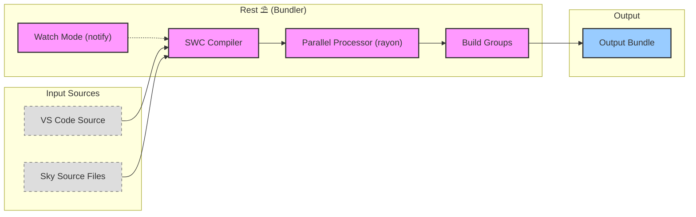

<table>
<tr>
<td align="left" valign="middle">
<h3 align="left">Rest</h3>
</td>
<td align="left" valign="middle">
<h3 align="left">⛱️</h3>
</td>
<td align="left" valign="middle">
<h3 align="left">+</h3>
</td>
<td align="left" valign="middle">
<h3 align="left">
<a href="https://Editor.Land" target="_blank">
<picture>
<source media="(prefers-color-scheme: dark)" srcset="https://PlayForm.Cloud/Dark/Image/GitHub/Land.svg">
<source media="(prefers-color-scheme: light)" srcset="https://PlayForm.Cloud/Image/GitHub/Land.svg">

</picture>
</a>
</h3>
</td>
<td align="left" valign="middle">
<h3 align="left">
<a href="https://Editor.Land" target="_blank">
Land
</a>
</h3>
</td>
<td align="left" valign="middle">
<h3 align="left">🏞️</h3>
</td>
</tr>
</table>

---

# **Rest** ⛱️ The JavaScript/TypeScript Bundler for Land 🏞️

[](https://github.com/CodeEditorLand/Rest/tree/Current/LICENSE)
[](https://crates.io/crates/Rest)
[](https://www.rust-lang.org/)
[](https://swc.rs/)

Welcome to **Rest**, the Rust-based JavaScript/TypeScript bundler and build
system for the **Land Code Editor**. Rest leverages the SWC (Speedy Web
Compiler) ecosystem for fast compilation and transformation of JavaScript and
TypeScript code, with parallel processing via rayon and intelligent watch mode
support.

**Rest** is engineered to:

1. **Provide Fast Bundling:** Utilize SWC's Rust-based compiler for
   high-performance JavaScript/TypeScript transformation.
2. **Enable Parallel Processing:** Leverage rayon for multi-threaded file
   processing and build group orchestration.
3. **Support Watch Mode:** Implement file system watching via notify for
   incremental development builds.
4. **Integrate with Git:** Provide Git repository operations for version
   tracking and change detection.

---

## Key Features 🔐

- **SWC Compiler Stack:** Leverages the full SWC ecosystem for fast parsing,
  transformation, and code generation of JavaScript/TypeScript.
- **Parallel Processing:** Multi-threaded file processing using rayon for
  maximum throughput during builds.
- **Watch Mode:** File system watching via notify for incremental development
  builds with automatic recompilation.
- **Build Groups:** Organized build task grouping for complex project structures
  with multiple output targets.
- **Git Integration:** Built-in Git repository operations for version tracking
  and change detection during builds.

---

## Core Architecture Principles 🏗️

| Principle              | Description                                                                             | Key Components Involved                           |
| :--------------------- | :-------------------------------------------------------------------------------------- | :------------------------------------------------ |
| **Performance**        | Utilize Rust and SWC for maximum bundling speed with minimal overhead.                  | `SWC` compiler stack, `rayon` parallel processing |
| **Incremental Builds** | Support watch mode for efficient development workflows with only changed files rebuilt. | `notify` file watcher, incremental cache          |
| **Modularity**         | Organize builds into groups for clear separation of concerns and output targets.        | Build Groups, task orchestration                  |
| **Git Awareness**      | Integrate with Git for version tracking and change-aware builds.                        | `git2` crate, change detection                    |

---

## `Rest` in the Land Ecosystem ⛱️ + 🏞️

| Component                  | Role & Key Responsibilities                                                                     |
| :------------------------- | :---------------------------------------------------------------------------------------------- |
| **VSCode Source Consumer** | Reads and transforms VS Code platform code from `Microsoft/VSCode` and `CodeEditorLand/Editor`. |
| **Output Producer**        | Generates bundled JavaScript artifacts consumed by `Cocoon` and `Sky`.                          |
| **Build Orchestrator**     | Coordinates with `Maintain` for build configuration and execution.                              |

---

## Getting Started 🚀

### Installation

To add `Rest` to your project:

```toml
[dependencies]
Rest = { git = "https://github.com/CodeEditorLand/Rest.git", branch = "Current" }
```

Or install the CLI:

```sh
cargo install Rest
```

**Key Dependencies:**

- `swc_*` crates: SWC compiler stack for JavaScript/TypeScript transformation
- `rayon`: Parallel processing for multi-threaded builds
- `notify`: File system watching for watch mode
- `git2`: Git repository operations
- `clap`: CLI argument parsing

### Usage Pattern

`Rest` is typically invoked through the build system:

```sh
# Run bundling with environment variables
pnpm cross-env \
	NODE_ENV=development \
	Bundle=true \
	Compile=false \
	pnpm tauri build
```

---

## Overview

Rest is a Rust-based JavaScript/TypeScript bundler and build system CLI tool. It
leverages the SWC (Speedy Web Compiler) ecosystem for fast compilation and
transformation of JavaScript and TypeScript code.

## Installation 🚀

```sh
cargo install Rest
```

## 🛠️ Usage

Rest uses a command structure based on `Struct::Binary::Command` pattern. The
main entry point executes via:

```rust
#[tokio::main]
async fn main() {
    (Struct::Binary::Command::Struct::Fn().Fn)().await
}
```

---

## System Architecture Diagram 🏗️

This diagram illustrates `Rest`'s role in the Land build pipeline.



---

## Features 🔐

- **Parallel Processing**: Multi-threaded file processing using rayon
- **SWC Integration**: Fast JavaScript/TypeScript compilation via SWC crates
- **Watch Mode**: File system watching for development
- **Git Integration**: Git repository operations support
- **Build Groups**: Organized build task grouping

## Dependencies

[Rest] relies on several Rust crates to provide its functionality:

### Core Dependencies

- `clap` - For parsing command-line arguments
- `tokio` - Asynchronous runtime
- `futures` - Asynchronous programming abstractions
- `rayon` / `par-core` - Parallel processing

### SWC Compiler Stack

- `swc_common` - Common utilities for SWC
- `swc_ecma_ast` - ECMAScript AST definitions
- `swc_ecma_parser` - JavaScript/TypeScript parser
- `swc_ecma_codegen` - Code generation
- `swc_ecma_transforms_base` - Base transforms
- `swc_ecma_transforms_proposal` - JavaScript proposal transforms
- `swc_ecma_transforms_typescript` - TypeScript transforms
- `swc_ecma_visit` - AST visitor traits

### Additional Tools

- `git2` - Git repository operations
- `num_cpus` - CPU count detection
- `regex` - Pattern matching
- `walkdir` / `globset` - Filesystem traversal
- `notify` - File system watching
- `chrono` - Date/time handling
- `serde` / `serde_json` - Serialization

[Rest]: https://crates.io/crates/Rest

---

## Deep Dive & Component Breakdown 🔬

To understand how `Rest`'s internal components interact to provide the
JavaScript/TypeScript bundling functionality, see the following source files:

- **[`Source/`](Source/)** - Main bundler implementation with SWC integration
- **[`Source/Build/`](Source/Build/)** - Build group orchestration and task
  management
- **[`Source/Watch/`](Source/Watch/)** - File system watching for development
  mode

The source files explain the SWC compiler stack integration, parallel processing
with rayon, and the build group configuration system.

---

## Changelog

See [`CHANGELOG.md`](https://github.com/CodeEditorLand/Rest/tree/Current/) for a
history of changes to this CLI.

## License ⚖️

This project is released into the public domain under the **Creative Commons CC0
Universal** license. You are free to use, modify, distribute, and build upon
this work for any purpose, without any restrictions. For the full legal text,
see the [`LICENSE`](https://github.com/CodeEditorLand/Rest/tree/Current/) file.

---

## Changelog 📜

Stay updated with our progress! See
[`CHANGELOG.md`](https://github.com/CodeEditorLand/Rest/tree/Current/) for a
history of changes specific to **Rest**.

---

## Funding & Acknowledgements 🙏🏻

**Rest** is a core element of the **Land** ecosystem. This project is funded
through [NGI0 Commons Fund](https://NLnet.NL/commonsfund), a fund established by
[NLnet](https://NLnet.NL) with financial support from the European Commission's
[Next Generation Internet](https://ngi.eu) program. Learn more at the
[NLnet project page](https://NLnet.NL/project/Land).

<table>
	<thead>
		<tr>
			<th align="left"><strong>Land</strong></th>
			<th align="left"><strong>PlayForm</strong></th>
			<th align="left"><strong>NLnet</strong></th>
			<th align="left"><strong>NGI0 Commons Fund</strong></th>
		</tr>
	</thead>
	<tbody>
		<tr>
			<td align="left" valign="middle">
				<a href="https://Editor.Land">
					
				</a>
			</td>
			<td align="left" valign="middle">
				<a href="https://PlayForm.Cloud">
					
				</a>
			</td>
			<td align="left" valign="middle">
				<a href="https://NLnet.NL">
					
				</a>
			</td>
			<td align="left" valign="middle">
				<a href="https://NLnet.NL/commonsfund">
					
				</a>
			</td>
		</tr>
	</tbody>
</table>

---

**Project Maintainers**: Source Open
([Source/Open@Editor.Land](mailto:Source/Open@Editor.Land)) |
[GitHub Repository](https://github.com/CodeEditorLand/Rest) |
[Report an Issue](https://github.com/CodeEditorLand/Rest/issues) |
[Security Policy](https://github.com/CodeEditorLand/Rest/security/policy)
